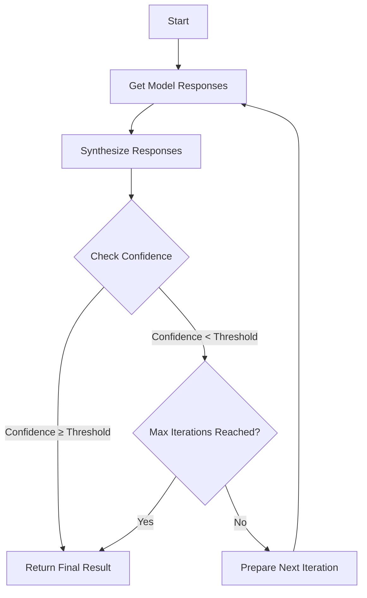

# LLM Consortium

## Inspiration

Based on Karpathy's observation:

> "I find that recently I end up using all of the models and all the time. One aspect is the curiosity of who gets what, but the other is that for a lot of problems they have this 'NP Complete' nature to them, where coming up with a solution is significantly harder than verifying a candidate solution. So your best performance will come from just asking all the models, and then getting them to come to a consensus."

This plugin for the `llm` package implements a model consortium system with iterative refinement and response synthesis. A parallel reasoning method that orchestrates multiple diverse language models to collaboratively solve complex problems through structured dialogue, evaluation, and arbitration.

## Core Algorithm Flow



## Features

- **Multi-Model Orchestration**: Coordinate responses from multiple models in parallel.
- **Iterative Refinement**: Automatically refine output until a confidence threshold is achieved.
- **Advanced Arbitration**: Uses a designated arbiter model to synthesize and evaluate responses.
- **Semantic Consensus Filtering**: Cluster response embeddings and keep the densest semantic region before arbitration.
- **Geometric Confidence**: Persist centroid-based agreement metadata alongside arbiter decisions.
- **Database Logging**: SQLite-backed logging of all interactions.
- **Embedding Visualization**: Project saved run embeddings and export HTML visualizations.
- **Configurable Parameters**: Adjustable confidence thresholds, iteration limits, and model selection.
- **Flexible Model Instance Counts**: Specify individual instance counts via the syntax `model:count`.
- **Conversation Continuation**: Continue previous conversations using the `-c` or `--cid` flags, just like with standard `llm` models. **(New in v0.8.0)**

## New Model Instance Syntax

You can define different numbers of instances per model by appending `:count` to the model name. For example:
- `"o3-mini:1"` runs 1 instance of _o3-mini_.
- `"gpt-4o:2"` runs 2 instances of _gpt-4o_.
- `"gemini-2:3"` runs 3 instances of _gemini-2_.
*(If no count is specified, a default instance count (default: 1) is used.)*

## Command Line Usage

Basic usage requires you to first save a consortium configuration (e.g., named `my-consortium`):

```bash
llm consortium save my-consortium \
    -m o3-mini:1 -m gpt-4o:2 -m gemini-2:3 \
    --arbiter gemini-2 \
    --confidence-threshold 0.8
```

Then invoke it using the standard `llm` model syntax:
```bash
llm -m my-consortium "What are the key considerations for AGI safety?"
```

This sequence will:
1. Send your prompt to multiple models in parallel (using the specified instance counts).
2. Gather responses along with analysis and confidence ratings.
3. Use an arbiter model to synthesize these responses.
4. Iterate to refine the answer until the confidence threshold or max iterations are reached.

### Conversation Continuation Usage **(New in v0.8.0)**

After running an initial prompt with a saved consortium model, you can continue the conversation:

To continue the most recent conversation:
```bash
# Initial prompt
llm -m my-consortium "Tell me about the planet Mars."
# Follow-up
llm -c "How long does it take to get there?"
```

To continue a specific conversation:
```bash
# Initial prompt (note the conversation ID, e.g., 01jscjy50ty4ycsypbq6h4ywhh)
llm -m my-consortium "Tell me about Jupiter."

# Follow-up using the ID
llm -c --cid 01jscjy50ty4ycsypbq6h4ywhh "What are its major moons?"
```


### Managing Consortium Configurations

You can save a consortium configuration as a model for reuse. This allows you to quickly recall a set of model parameters in subsequent queries.

#### Saving a Consortium as a Model
```bash
llm consortium save my-consortium \
    --model claude-3-opus-20240229 \
    --model gpt-4 \
    --arbiter claude-3-opus-20240229 \
    --confidence-threshold 0.9 \
    --max-iterations 5 \
    --min-iterations 1 \
    --system "Your custom system prompt"
```

Once saved, you can invoke your custom consortium like this:
```bash
llm -m my-consortium "What are the key considerations for AGI safety?"
```
And continue conversations using `-c` or `--cid` as shown above.

#### Listing Available Strategies
```bash
llm consortium strategies
```

#### Semantic Strategy Example
```bash
llm consortium save test-semantic \
    -m gpt-4:2 \
    -m claude-3:2 \
    --arbiter gpt-4 \
    --strategy semantic \
    --embedding-backend chutes \
    --embedding-model qwen3-embedding-8b \
    --clustering-algorithm dbscan \
    --cluster-eps 0.35 \
    --cluster-min-samples 2
```

The semantic strategy stores per-response embeddings, consensus-cluster metadata, and arbiter-side geometric confidence in the consortium SQLite database.


#### Notes on Strategy Behavior
- Repeating `--strategy-param key=value` now accumulates repeated keys into lists, which is required for role definitions such as repeated `roles=...` entries.
- `strategy=elimination` automatically normalizes `judging_method` to `rank`, since the elimination strategy depends on arbiter ranking output.
- Geometric confidence measures response-shape agreement, not factual correctness. High geometric confidence means the surviving responses are close in embedding space; it does not prove the answer is true.

## Programmatic Usage

Use the `create_consortium` helper to configure an orchestrator in your Python code. For example:

```python
from llm_consortium import create_consortium

orchestrator = create_consortium(
    models=["o3-mini:1", "gpt-4o:2", "gemini-2:3"],
    confidence_threshold=1,
    max_iterations=4,
    minimum_iterations=3,
    arbiter="gemini-2",
)

result = orchestrator.orchestrate("Your prompt here")
print(f"Synthesized Response: {result['synthesis']['synthesis']}")
```
*(Note: Programmatic conversation continuation requires manual handling of the conversation object or history.)*

## License

Apache-2.0 License

## Credits

Developed as part of the LLM ecosystem and inspired by Andrej Karpathy’s insights on collaborative model consensus.

## Changelog

Please refer to the [CHANGELOG.md](CHANGELOG.md) file for documented history and updates.
## Installation

### Quick Start (Recommended)

For a complete development setup:

```bash
git clone https://github.com/irthomasthomas/llm-consortium.git
cd llm-consortium
./scripts/setup.sh
```

Or using `make`:

```bash
make install-all  # Installs with all extras
```

### Using `llm` CLI

First install `llm`:

```bash
uv tool install llm
```

Then install the consortium plugin:

```bash
llm install "llm-consortium"
# Or with all features:
llm install "llm-consortium[embeddings,visualize]"
```

### Manual Installation

1. Clone the repository:
   ```bash
   git clone https://github.com/irthomasthomas/llm-consortium.git
   cd llm-consortium
   ```

2. Install with pip:
   ```bash
   # Basic installation
   pip install -e .
   
   # With all dependencies
   pip install -e ".[embeddings,visualize,dev]"
   ```

3. Or use the Makefile targets:
   ```bash
   make install          # Basic installation
   make install-dev      # With development tools
   make install-all      # With all extras (recommended)
   ```

### Dependencies

Core dependencies (automatically installed):
- `llm`: The core LLM plugin framework
- `click`: CLI framework
- `httpx`: HTTP client for API calls
- `sqlite-utils`: Database utilities
- `asyncio`: Async support
- `numpy`: Numerical operations
- `colorama`: Terminal colors
- `pydantic`: Data validation

Optional extras:
- **embeddings**: `scikit-learn`, `hdbscan`, `openai`, `sentence-transformers`
- **visualize**: `plotly`
- **dev**: `pytest`, `pytest-cov`, `black`, `flake8`

### Provider Setup

For embeddings support:
- Set `OPENAI_API_KEY` for OpenAI backend
- Set `CHUTES_API_TOKEN` for Chutes backend


## Troubleshooting

### Externally Managed Environment Error (PEP 668)

If you get an error like:
```
error: externally-managed-environment
```

This is because your Python installation is managed by the system (common on Arch Linux, Fedora, etc.). Solutions:

1. **Use the provided quick setup script:**
   ```bash
   ./scripts/quick_setup.sh
   ```

2. **Use a virtual environment manually:**
   ```bash
   python -m venv .venv
   source .venv/bin/activate
   pip install -e ".[embeddings,visualize,dev]"
   ```

3. **Use `uv` (recommended on Arch Linux):**
   ```bash
   # Install uv if not available
   pip install --user uv
   
   # Create environment and install
   uv venv
   source .venv/bin/activate
   uv pip install -e ".[embeddings,visualize,dev]"
   ```

4. **Use `pipx` for system-wide installation:**
   ```bash
   pipx install -e . --force
   ```

### Plugin Not Registering

If `llm plugins` doesn't show `llm-consortium`:

1. Install in development mode:
   ```bash
   source .venv/bin/activate
   llm install -e .
   ```

2. Check the entry point:
   ```bash
   python -c "import pkg_resources; print([ep for ep in pkg_resources.iter_entry_points('llm')])"
   ```

3. Reinstall the plugin:
   ```bash
   pip uninstall llm-consortium
   pip install -e .
   llm install -e .
   ```

### Missing Dependencies

If you get import errors:

1. Install all dependencies:
   ```bash
   pip install -e ".[embeddings,visualize,dev]"
   ```

2. Or install just the core:
   ```bash
   pip install -e .
   ```

### Testing the Installation

Run the test script:
```bash
./scripts/test_installation.sh
```

Or manually test:
```bash
source .venv/bin/activate
llm consortium --help
```
